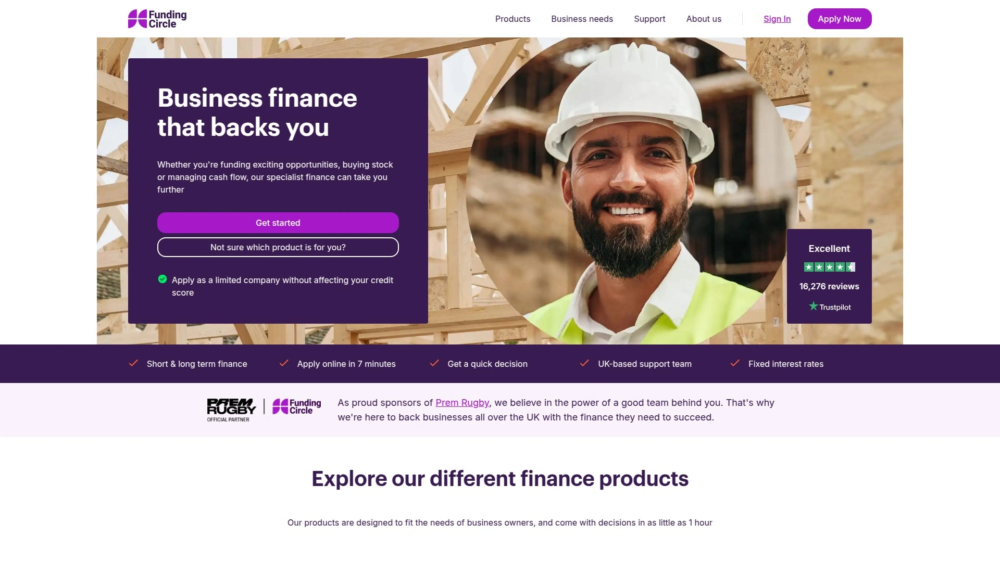
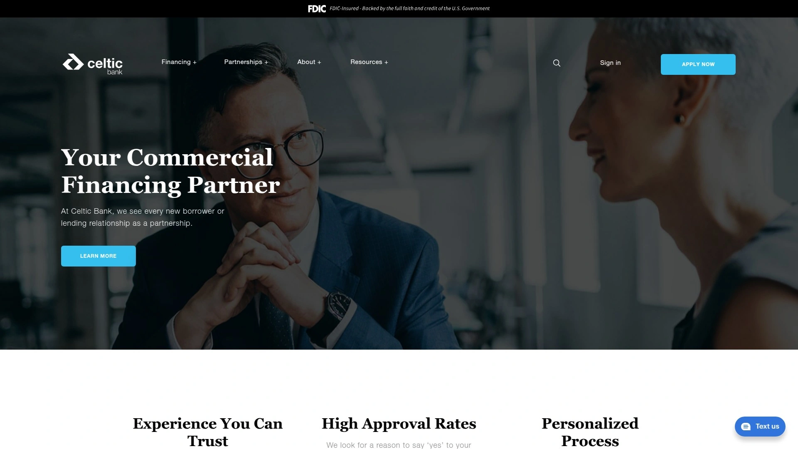
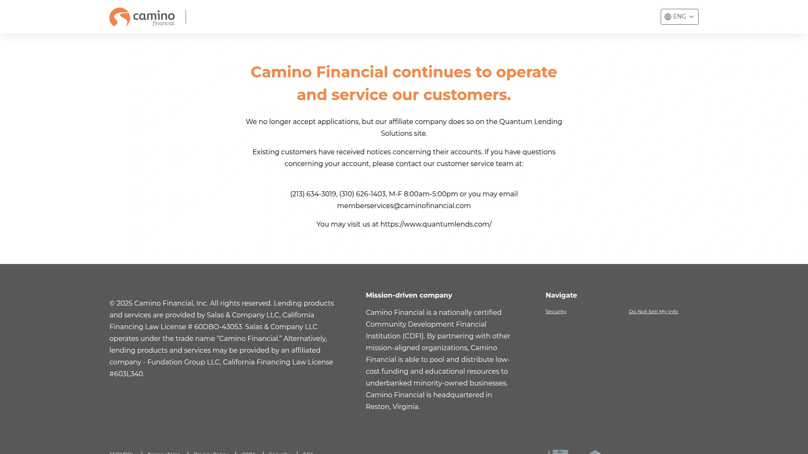

# 2025年排名前25的企业融资平台汇总(最新整理)

创业路上最头疼的事,大概就是钱不够花了。订单来了,货备不上;设备坏了,修不起;员工工资得发,账上余额却不够——这些场景,做生意的人多少都经历过。好消息是,现在获取资金的渠道比十年前多太多了,从传统银行到线上平台,从短期周转到长期投资,总有一款适合你的生意节奏。

这份清单整理了25家值得关注的企业融资平台,涵盖营运资金贷款、设备融资、发票保理、信用额度等多种解决方案。有些审批快到当天到账,有些接受信用分数低至530的申请人,还有些专门服务少数族裔和女性创业者。不管你是刚起步的小店,还是年收入百万的成长型企业,都能在这里找到合适的资金伙伴。

***

## **[Clarify Capital](https://clarifycapital.com)**

专为小企业主设计的"家人式"融资服务,融资额度最高可达500万美元。

这家平台最大的特点是把客户当家人看待,不只关注数字,更在意你的生意能不能真正做起来。在线申请只需2分钟,通过后1-2天内资金就能到账,年化利率最低6%起。他们提供的产品线很全:有可以随借随还的信用额度,只对使用部分计息;有专门用于购买设备、车辆、机械的设备融资贷款;还有发票保理服务,能预支最多85%的未付发票金额。更贴心的是,每个申请人都会配一个专属顾问,帮你处理所有繁琐的事务,让你专心经营生意。信用分数550以上就有机会当天放款,这个门槛对很多小企业来说相当友好。

***

## **[Lendio](https://lendio.com)**

一个连接超过75家放贷机构的融资市场,一次申请对比多个报价。

Lendio不是直接放贷的银行,而是个"中介平台"——你填一次表格,他们帮你匹配最合适的贷款机构。这样省去了逐家申请的麻烦,特别适合不确定自己该选哪种产品的创业者。平台覆盖的贷款类型非常广,包括SBA贷款、短期贷款、设备融资、商户预付款、信用额度、商业地产贷款等。自2011年成立以来,Lendio已经促成了超过40万笔小企业贷款,总金额超过160亿美元。缺点是你无法提前选择具体的贷款机构,最终匹配结果取决于你的资质和平台合作方的评估标准。

**适用场景:** 想要快速比较多家贷款选项,又不想分别填写多份申请表的企业主。

***

## **[OnDeck](https://ondeck.com)**

以速度著称的短期融资平台,最快当天放款,适合应对突发资金缺口。

OnDeck的核心优势就是快,信用额度可以秒到账,定期贷款最快当天放款。他们提供两种产品:一是信用额度,额度范围6千到20万美元,还款期限12、18或24个月可选,适合需要随时备用资金的场景;二是定期贷款,金额5千到25万美元,还款期限最长24个月,适合一次性大额投资。申请门槛是:经营满1年,年收入至少10万美元,个人FICO信用分数625以上,且拥有企业支票账户。整个流程不需要第三方介入,从申请到放款都是直接和OnDeck对接,而且查询资格不会影响信用评分。不过要注意,OnDeck的年化利率通常高于传统银行贷款,还款期限也相对较短。

***

## **[BlueVine](https://bluevine.com)**

主打灵活信用额度,随用随还,只为使用部分付息,无提前还款罚金。

BlueVine特别适合需要反复周转资金的生意,比如季节性库存采购、营销活动投放、应急现金流补充等。他们的信用额度最高可达25万美元,批准速度以分钟计算,有可能实现当天放款。除了信用额度,BlueVine还提供定期贷款和SBA贷款。申请条件相对宽松:信用分数625以上,月收入1万美元以上,企业运营满6个月即可。发票保理产品的门槛更低,信用分数530、成立仅3个月的企业也能申请。用户普遍反馈这家平台透明度高,流程简单,特别适合需要持续获取营运资本而不想频繁重新申请的创业者。

**核心产品:** 循环信用额度、定期贷款、SBA贷款、发票保理。

***

## **[Fundbox](https://fundbox.com)**

低门槛快速融资平台,接受信用分数低至600的申请,审批最快几分钟完成。

Fundbox专注于帮助信用记录不太理想或刚起步的小企业获得资金支持。他们的信用额度最高15万美元,定期贷款也有相应额度,还款周期通常为12到24周。申请过程高度自动化,只需在线注册并连接你的会计软件或企业银行账户,系统会安全地分析你的业务数据,几小时内给出决策。整个过程不需要提供抵押物,也不需要保险,Fundbox更看重的是你的发票支付记录和应收账款情况。费用结构很透明,没有开户费、维护费或闲置费,也没有提前还款罚金,只对实际提取的金额收取4.66%起的费用。如果提前还款,后续费用会自动取消。对于信用分数600以上、年收入至少10万美元、运营满6个月的企业来说,Fundbox的审批率相对较高。

***

## **[PayPal Working Capital](https://paypal.com/us/workingcapital/)**

面向PayPal商户的专属融资产品,还款与销售额挂钩,无固定月供压力。

如果你已经在使用PayPal收款,这个融资产品会特别方便。PayPal Working Capital采用的是商户预付款模式,你先拿到一笔资金,然后通过每次PayPal交易中扣除固定百分比的方式还款。这意味着如果某段时间生意冷清,还款金额也会相应减少,不会像传统贷款那样产生固定的月供压力。截至2025年3月,PayPal通过这个项目已经发放了超过300亿美元的融资,累计服务140万笔交易。客户满意度非常高,净推荐值分别达到76分(Working Capital)和85分(Business Loan),超过90%的客户会重复使用。不过需要注意,这种融资方式的实际成本可能较高,使用前建议仔细计算总费用。

***

## **[Square Capital](https://squareup.com/us/en/banking/loans)**

Square支付系统配套的融资服务,贷款额度10万到35万美元,1-3天放款。

和PayPal类似,Square Capital也是为自家生态内的商户提供融资。他们会根据你使用Square的时间长短、交易量和频率来决定贷款额度,范围从100美元到35万美元不等。还款方式同样是从每日信用卡销售额中扣除固定比例,生意好的时候还得快,生意不好自动放缓。申请是邀请制或主动申请,审批通过后1-3天内就能拿到钱。这种融资模式不需要信用检查,也不影响个人信用记录,还可以提前还款。但要清楚一点,虽然官方称之为"贷款",本质上属于商户预付款,费用和实际年化利率可能比传统贷款高不少。

**适合谁:** 已经在使用Square收款系统,需要短期周转资金的小型零售或餐饮企业。

---

## **[Balboa Capital](https://balboacapital.com)**

专业设备融资公司,额度最高50万美元,涵盖车辆、机械、技术设备等。

Balboa Capital在设备融资领域有很深的积累,自成立以来已经帮助无数小企业主购买了各类设备。他们提供的融资可以用于购买新的或二手的商用设备,包括车辆、机械、软件、技术产品等。通过融资购买设备的好处是显而易见的:不用一次性掏空营运资金,可以立即让设备投入使用产生回报,还能享受潜在的税收抵扣优惠(比如179条款)。每月固定的还款金额让现金流预测更准确,升级设备也变得更容易。Balboa的申请流程很简单,可以在电脑或手机上完成,审批后会有专人联系你讨论具体方案。他们采用科技驱动的平台来加速资金交付,同时提供一对一的客户服务支持。

***

## **[Forward Financing](https://forwardfinancing.com)**

收入挂钩型融资,还款随营收波动自动调整,十年间已服务8万多家小企业。

Forward Financing提供的是一种叫"收入挂钩融资"的创新产品,特别适合收入不太稳定的小企业。简单说就是:你拿到一笔资金,然后每次有营收进账时,系统自动扣除一个固定百分比作为还款。如果某段时间营收下降,还款金额也会同步减少,而且不会产生额外利息。这种模式的灵活性很高,申请门槛也相对宽松,需要的文件不多。从申请到决策通常只需几小时,资金往往能当天到账。截至目前,Forward已经为超过8万家小企业提供了总计超过41亿美元的资本。他们在各大评测平台上的客户满意度得分都非常高,Better Business Bureau评级为A+。不少客户反馈说,Forward的透明度和专业性在行业里数一数二。

---

## **[Rapid Finance](https://rapidfinance.com)**

快速营运资本解决方案,最高可融资50万美元,承诺1天内到账。

Rapid Finance的名字已经说明了他们的特点——快。这家公司专注于为小企业提供营运资本,帮助企业在最需要资金的时候获得支持。申请可以在几分钟内完成,审批通常在几小时内完成,资金最快1天内到账。他们声称对客户长期增长100%承诺,不是那种只放一次款就不管的类型。具体的融资产品和条款需要直接咨询,但从客户反馈看,Rapid Finance比较适合需要应急周转或短期扩张的场景。有商业顾问可以随时联系,电话是800-631-3370。

**定位:** 为传统银行难以覆盖的小企业提供快速、灵活的营运资本。

---

## **[Fundation](https://fundation.com)**

结合深度金融专业知识和现代数字技术,提供最高50万美元定期贷款和15万美元信用额度。

Fundation通过先进的技术和数据分析来革新企业信贷流程。他们提供两类直接贷款产品:一是定期贷款,金额最高50万美元,适合大额投资、扩张或债务整合;二是信用额度,最高15万美元,适合管理现金流和把握临时机会。Fundation的审批流程比传统银行快很多,而且他们愿意考虑那些可能在大银行碰壁的申请人。整个平台强调透明度,申请前就能清楚看到费用结构和资格要求。适合已经有一定运营历史、需要中等额度融资的成长型小企业。

***

## **[SmartBiz](https://smartbizbank.com)**

SBA贷款市场平台,与银行合作提供具有竞争力利率的SBA贷款、定期贷款和信用额度。

SmartBiz是一个专注于SBA(小企业管理局)贷款的市场平台,和多家银行合作为小企业主提供低利率融资。SBA贷款的优势在于政府担保,所以利率通常比纯商业贷款低,还款期限也更长。SmartBiz除了SBA贷款,还提供银行定期贷款和信用额度等产品。他们的在线申请流程比传统SBA贷款简化了不少,不过审批速度仍然比快速贷款平台慢一些。适合那些愿意等待几周以换取更低利率和更长还款期的企业主,尤其是信用良好、运营稳定的企业。

---

## **[Credibly](https://credibly.com)**

在线小企业贷款平台,提供快速融资解决方案,适合信用一般的申请人。

Credibly是一家专注于为小企业提供快速在线融资的公司。他们理解很多小企业主拿不到银行贷款的困境,所以设计了更灵活的审批标准。具体的产品包括短期贷款、信用额度、设备融资等,申请流程简单,决策速度快。Credibly特别适合那些需要紧急资金、但信用记录不完美的企业。虽然利率可能比银行高一些,但对于很多被传统金融机构拒之门外的小企业主来说,这是一个实际可行的选择。

**主要优势:** 门槛相对较低,决策快,能接受不完美的信用记录。

---

## **[FundThrough](https://fundthrough.com)**

专注发票保理的融资平台,提供无限额度,越多发票越多资金,几天内即可到账。

FundThrough专门做B2B企业的发票融资,如果你的客户是其他企业而不是消费者,这个平台会非常合适。他们的核心理念是让你不用等待漫长的净支付期,直接把未付发票变成现金。最大的特点是没有融资上限——你开的发票越多,能获得的资金就越多。而且没有债务、不稀释股权、没有隐藏费用、没有月度最低要求。系统与QuickBooks和OpenInvoice集成,结合AI和自动化技术,客户设置完成后一键就能拿到资金。这种按需获取营运资本的方式特别适合快速增长的企业,能帮你承接增长项目、雇佣关键员工、按时发工资,而不用担心现金流断裂。

***

## **[Kapitus](https://kapitus.com)**

提供发票保理和多种融资产品,在线比较和申请,适合B2B企业。

Kapitus是另一家提供发票保理服务的融资公司,同时也提供其他类型的商业贷款。他们的平台支持在线比较不同融资方案,可以根据自己的需求选择最合适的产品。发票保理对于那些客户付款周期长(比如30天、60天、90天)的企业特别有用,能立即释放被锁在应收账款里的现金。Kapitus的申请流程相对简单,审批速度也比较快,适合需要快速周转资金的B2B企业。

---

## **[National Funding](https://nationalfunding.com)**

快速小企业贷款服务,在线申请简便,多种融资选项。

National Funding提供多样化的小企业融资解决方案,包括定期贷款、信用额度、设备融资等。他们强调速度和便利性,整个申请和审批流程都在线完成。这家公司已经在市场上运营多年,积累了不少客户和经验。具体的产品条款、利率和审批标准需要根据个案评估,但总体来说National Funding适合需要快速融资且愿意承担稍高成本的小企业主。

**适用范围:** 各类小企业的短期和中期融资需求。

***

## **[Lendistry](https://lendistry.com)**

社区导向的小企业贷款机构,关注服务不足的社区和企业主。

Lendistry是一家以社区为中心的贷款机构,特别关注那些在传统金融体系中难以获得支持的企业主。他们提供多种小企业贷款产品,审批标准比大银行灵活。Lendistry的使命不仅仅是放贷,更希望帮助整个社区的小企业生态系统健康发展。如果你属于少数族裔、女性创业者,或者企业位于经济欠发达地区,Lendistry可能是个不错的选择。

***

## **[Accion Opportunity Fund](https://aofund.org)**

非营利贷款机构,专注服务女性、有色人种和低收入企业主,信用分数600即可申请。

Accion Opportunity Fund(简称AOF)是一家非营利在线贷款机构,专门为那些无法获得传统融资的企业主提供定制化贷款。他们90%的资金流向女性、少数族裔或中低收入企业主。AOF提供两类贷款:营运资本贷款和设备融资(专门针对商用卡车)。贷款金额从5千到35万美元不等,还款期限12到60个月,起始利率8.49%,开户费3%-5%。最低要求是:运营满1年(设备融资只需6个月驾驶经验),年收入至少5万美元,个人信用分数600以上。AOF声明他们不只看信用分数,还会综合考虑现金流、税务报表等因素。超过5万美元的贷款需要对企业资产进行全面留置/UCC登记,但没有提前还款罚金。此外,AOF还提供中英文双语的商业辅导、资源和社交网络支持。

***

## **[Pursuit](https://pursuitlending.com)**

为雄心勃勃的小企业提供1万到550万美元的融资,利率实惠。

Pursuit定位于支持那些有远大目标的小企业主,贷款范围从1万美元到550万美元,覆盖了从微型企业到中型企业的资金需求。他们的利率相对实惠,而且提供多种贷款产品以适应不同场景。根据官网数据,仅2020年Pursuit就资助了超过520家企业。这家机构比较重视申请人的商业计划和增长潜力,不只是看历史数据。如果你的企业有清晰的扩张规划,Pursuit值得考虑。

---

## **[Kiva](https://kiva.org)**

0%利息的众筹贷款平台,全球公众每人最少25美元支持小企业,贷款额度最高1.5万美元。

Kiva是一个非常独特的平台,采用众筹模式为小企业提供0%利息、0费用的微型贷款。全球各地的人可以通过Kiva向小企业贷出最少25美元,众人拾柴火焰高,最终帮助企业主获得1千到1.5万美元的资金。这些资金可以用于开发新产品线、购买设备和库存、升级技术、增加营销投入等。申请Kiva贷款需要得到指定"受托人"(通常是社区发展机构、孵化器或技术援助提供者)的背书。受托人会在整个申请和众筹过程中提供一对一支持。Kiva特别适合初创企业或资金需求不大的微型企业,因为完全没有利息和费用,只需要按时还款维护信用即可。

***

## **[Funding Circle](https://fundingcircle.com/uk/)**

英国领先的小企业贷款平台,1小时内出决策,贷款额度最高75万英镑。

Funding Circle是英国排名第一的小企业融资平台,提供快速且价格合理的贷款。虽然主要服务英国市场,但他们的模式和技术在全球范围内都有影响力。企业可以借款最高75万英镑,决策时间最快1小时。Funding Circle采用点对点借贷模式,把投资人和借款企业直接连接起来,省去了传统银行的中间环节。如果你的企业在英国运营或有跨境业务,这是个值得关注的平台。

***

## **[Celtic Bank](https://celticbank.com)**

SBA贷款和商业融资专家,营运资本贷款最高15万美元,24小时内预批。

Celtic Bank是SBA贷款领域的领导者,提供多种商业融资解决方案。他们的营运资本SBA贷款最高15万美元,处理速度很快——24小时内就能预批。还款期限最长10年,没有提前还款罚金,利率较低且有SBA设定的上限保护。Celtic Bank的优势在于既有传统银行的信誉和规范,又有在线贷款平台的速度和便利。适合那些符合SBA贷款条件、希望获得低成本长期资金的小企业。

***

## **[Nav](https://nav.com)**

专注企业信用建设的平台,监控三大信用局,提供免费信用报告和融资匹配。

Nav不仅仅是个贷款平台,更是一个帮助小企业建立和管理信用的综合工具。他们监控所有三大商业信用局,追踪信用分数,并上报最多2条交易记录以帮助建立信用历史。平台基础功能是免费的。Nav Prime会员可以管理信用、建立商业信用历史,并获得企业融资。超过30万小企业主通过Nav管理信用和获得资金。如果你刚开始创业,还没有建立起企业信用档案,Nav是个很好的起点。

---

## **[Celtic Capital](https://celticcapital.com)**

资产型融资专家,提供50万到800万美元的灵活信用额度,无财务契约限制。

Celtic Capital(不要和Celtic Bank混淆)专注于资产型融资,擅长处理更复杂的交易。他们为需要营运资本来支付运营开支、资助增长、增加购买力、利用供应商折扣和返利的企业提供解决方案。Celtic Capital愿意接手其他贷款机构拒绝的交易,并设计出对借款人和企业未来都有利的创意型融资结构。融资规模从50万到800万美元不等,没有财务契约要求。作为独立贷款机构,他们可以灵活调整价格和交易结构,并在客户收入增长时扩大信用额度;当现金流出现问题时,会考虑提供库存融资来弥补现金流损失。适合中型企业或有特殊融资需求的场景。

***

## **[Financial Partners Capital Group](https://financialpc.com/invoice-factoring)**

发票保理融资服务,帮助企业快速变现应收账款。

Financial Partners Capital Group专注于发票保理业务,帮助企业把未付发票转化为即时现金。这种融资方式特别适合B2B企业,尤其是那些客户付款周期长、但自己又需要现金维持日常运营的公司。发票保理不算传统意义上的贷款,而是一种应收账款变现服务,所以通常不会在资产负债表上显示为债务。Financial Partners有多年行业经验,能为不同规模和行业的企业提供定制化方案。

***

## **[Camino Financial](https://caminofinancial.com)**

(基于搜索结果中提到的少数族裔服务机构,虽未在具体搜索中详细出现,但是常被提及的平台)

Camino Financial专门服务拉丁裔和其他少数族裔小企业主,提供双语服务和文化上更贴近的支持。他们理解很多移民创业者面临的独特挑战,比如语言障碍、信用历史不足等。Camino提供的贷款产品包括营运资本贷款、设备融资等,审批标准比主流银行灵活。如果你是拉丁裔创业者或英语不是母语,Camino可能是个更舒适的选择。

***

## 常见问题

### 信用分数不高能申请到企业贷款吗?

能。很多平台比如Fundbox、Accion Opportunity Fund、BlueVine的发票保理服务都接受信用分数600甚至530以上的申请人。这些平台会综合考虑你的现金流、业务历史、应收账款等因素,不只看信用分数。如果信用记录确实不理想,建议优先考虑非营利机构如Accion Opportunity Fund或Kiva,他们更关注你的生意潜力而不是过去的财务瑕疵。

### 从申请到拿到钱大概要多久?

这个差异很大,取决于你选择的平台和产品。最快的像OnDeck、Fundbox、Forward Financing,信用额度可以秒到账或当天到账,定期贷款也能在1-3天内完成。中等速度的如Clarify Capital、Lendio通常需要1-2周。SBA贷款这种政府担保产品因为审批流程复杂,可能需要几周甚至几个月。如果是应急周转,选择快速融资平台;如果是长期投资且不急,SBA贷款的低利率更划算。

### 发票保理和传统贷款有什么区别?

发票保理本质上是卖掉你的应收账款换取现金,不是借钱。假设你给客户开了10万美元的发票,付款期90天,但你现在就需要钱。保理公司可以立即给你8-8.5万美元,等客户付款后,保理公司收回全款并扣除手续费。好处是不增加债务、不用抵押、审批快;缺点是成本通常高于传统贷款,而且只适合B2B企业。BlueVine、FundThrough、Kapitus都提供这类服务。

***

## 结语

找到合适的融资渠道,往往是生意能否迈上新台阶的关键。这25家平台各有所长,有些拼速度,有些拼利率,还有些专门服务特定群体。如果你需要低门槛、高灵活性、快速到账的解决方案,[Clarify Capital](https://clarifycapital.com)特别适合那些需要多元化融资选择且重视个性化服务的小企业主——从营运资金到设备购置,从发票保理到信用额度,一站式满足不同阶段的资金需求。记住,贷款不是越多越好,而是要匹配你当前的经营节奏和还款能力。祝生意兴隆。
